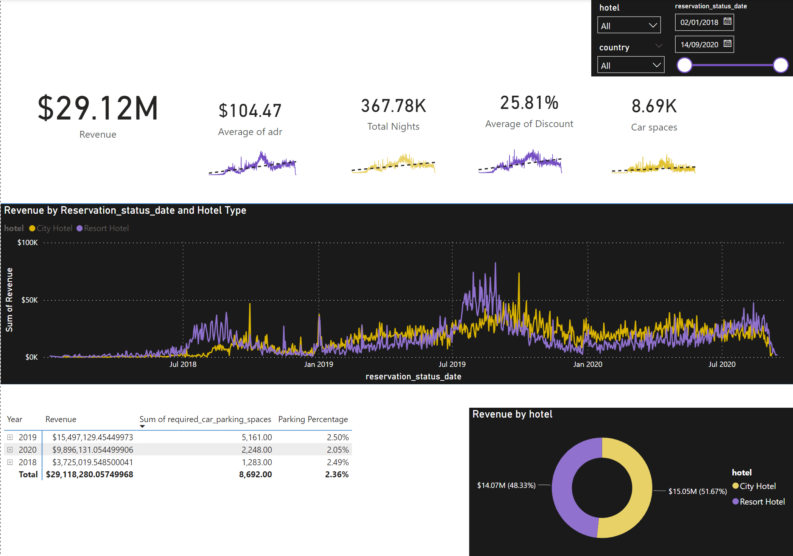

# Exploratory-Analysis-of-Hotel-Performance-and-trends
 
## Introduction
The aim of this project is to analyze the revenue, occupancy rate and parking space utilization of a hotel company in order to gain insights into their performance and identify potential areas for improvement.

## Methodology
To conduct the analysis, I utilized SQL and Power Bi to process and visualize the data. Power BI allowed me to create interactive dashboards and generate visualizations while SQL was used for data manipulation and filtering.

## Data Overview
The analysis will span multiple years from 2018 to 2020, utilizing the dataset titled hotel_revenue_data.csv, which is included in the repository.The keys variables analyzed in this project are revenue, occupancy rates, room nights, and car spaces.

 
## Findings and Insights
1.	Revenue: Overall, hotel revenue showed an upward trend over the analyzed period. The highest revenue was generated by the city hotels, while resort hotels contributed a smaller portion.
City hotels have been the primary driver of revenue, indicating the importance of focusing on their performance and customer satisfaction.
2.	Occupancy Rates: Occupancy rates varied across different hotel types and geographical locations. City hotels consistently had higher occupancy rates compared to resort hotels.
Resort hotels may require additional strategies to increase occupancy rates and attract more guests.
3.	Parking Space Utilization: The analysis of car space utilization revealed that only a small percentage of guests booked car spaces. The utilization rate remained relatively stagnant, indicating no immediate need for expanding the parking lot size

## Conclusion
In conclusion, this data analysis project aimed to provide insights into hotel revenue, occupancy rates, and parking space utilization. The findings suggest a positive revenue trend, stable occupancy rates, and low demand for parking spaces. Based on these findings, recommendations were made to focus on revenue enhancement, occupancy rate optimization, and cautious parking space management. It is important to continuously monitor and analyze data to make informed decisions and improve the overall performance of the hotels.
For more detailed analysis, including interactive dashboards and visualizations, please refer to the Power BI project files in the GitHub repository.

## Limitation
It is important to note that this analysis is based on a specific dataset and may not capture all factors influencing hotel performance. 
